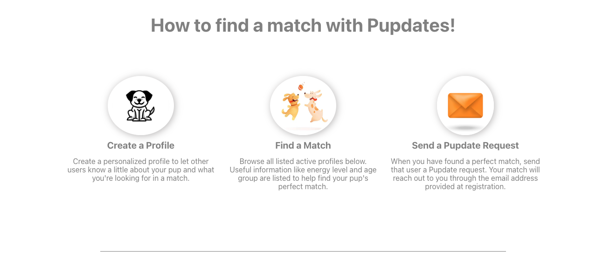
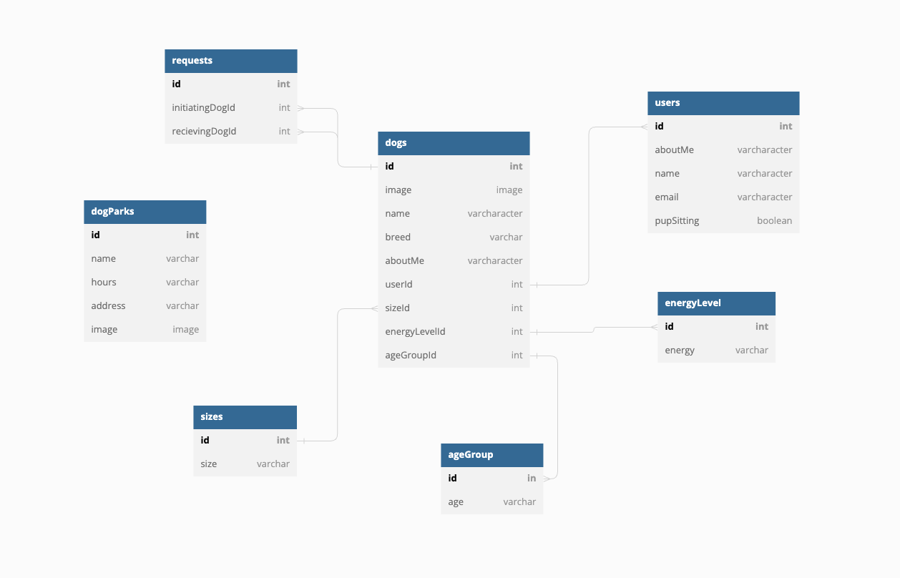

# Pupdates

### *Pupdates is a playdate scheduling application for your pup!*

## Application Overview
This application enables dog owners and their dogs to connect with other owners and their dogs in the Nashville community, with an enhanced goal of creating matches for sharing dog sitting responsibilities when needed (‘Pupsitting’) - eliminating the need for boarding kennels.

This project is my front end capstone, created in two weeks, after three months of being introduced to front end development. My goals were to incorporate CRUD functionality, gain a deeper understanding of React and build an intuitive and user friendly interface without the use of bootstrapped components. 

## Features
* Users can browse/filter/search other user profiles
* Users can create/edit/delete their profiles
* Users can send and approve pupdate requests
* Users can view information about Nashville's local dog parks



## Technology Used


## Running This Application

***Disclaimer:** This application uses mock authentication for demonstration purposes. As such, the login and registration are completely insecure and would not be implemented in a professional application.*

1.  Clone this repository and change to this directory in the terminal.
```
git clone git@github.com:neszeto/pupdates.git
cd pupdates
```
2. Start development server
```
npm install --save react-router-dom
npm start
```

3. Clone the api repository and connect JSON
```
git clone git@github.com:neszeto/pupdates-api.git
cd pupdates-api
json-server database.json -p 8088 -w
```

## Demo User Login
To view the application as a registered user, please sign in using the following email: **steve@gmail.com**

OR register and sign in as a new user 

## ERD


### Created By Nora Szeto <a href="https://www.linkedin.com/in/nora-szeto/" target="_blank">Linkin</a>
